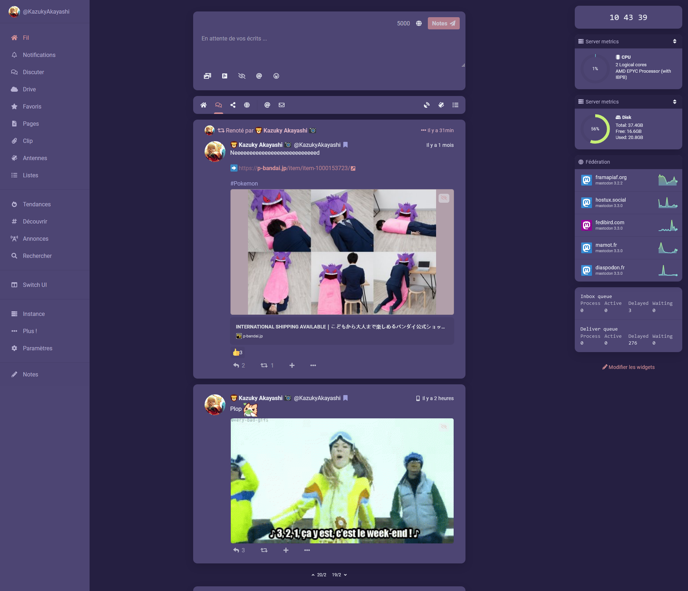

# Nebula theme
Theme inspired by the unusual Nebula effect from Team Fortress 2 😅

## Use

```
{
	id: '1f75fa87-93de-4f3e-bc79-5b352e37a2c1',
	base: 'dark',
	desc: 'Theme inspired by the unusual Nebula effect from Team Fortress 2',
	name: 'Nebula',
	props: {
		bg: '#251F41',
		fg: '#eceff4',
		cwBg: '#6D5EB0',
		cwFg: '#fefefe',
		link: '#DB9499',
		badge: '#9C9CD8',
		navBg: '#4D4573',
		navFg: '#B7B1D3',
		panel: '#4D4573',
		accent: '#DB9499',
		header: '@panel',
		pageBg: '@panel',
		renote: '#DBB3C4',
		divider: 'rgba(37, 31, 65, 0.2)',
		hashtag: '#A9A9DF',
		mention: '#bf616a',
		cwHoverBg: '#6051A4',
		indicator: '#BE6F91',
		navActive: '@accent',
		infoWarnBg: '#ECD379',
		infoWarnFg: '#2e3440',
		navHoverFg: '@accent',
		navIndicator: '#BE6F91',
		driveFolderBg: '@panel',
		fgHighlighted: '@accent',
		panelHeaderBg: '#282244',
		panelHeaderFg: '#B7B1D3',
		panelHeaderDivider: 'rgba(64, 57, 96, 0.75)',
	},
	author: '@kazukyakayashi@meow.zarchbox.fr',
}
```

#Screenshot


